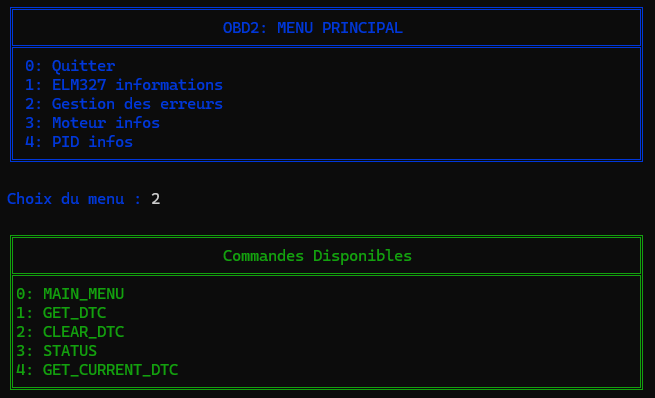

# OBD2 Python

This repository is designed for those who want to retrieve information about their vehicle and have an ELM327 Bluetooth adapter.




## Bluetooth Configuration on Windows

To configure Bluetooth for the ELM327 on Windows, follow these steps:

1. Go to **Settings** > **Bluetooth**.
2. Click on **Devices**.
3. Select **More Bluetooth options**.
4. Navigate to the **COM Ports** tab.
5. Click on **Add**.
6. Choose **Outgoing Serial Port** and select your OBDII device.

## Software Requirements

You will need Python 3 and the `obd` library. To install the library, run the following command:

```bash
pip install obd
```
## Code

To test my code with your vehicle, change DEVELOPER_MODE parameter at False.
Don't forget to change the serial port if you don't have the same.

## Sources

https://python-obd.readthedocs.io/en/latest/